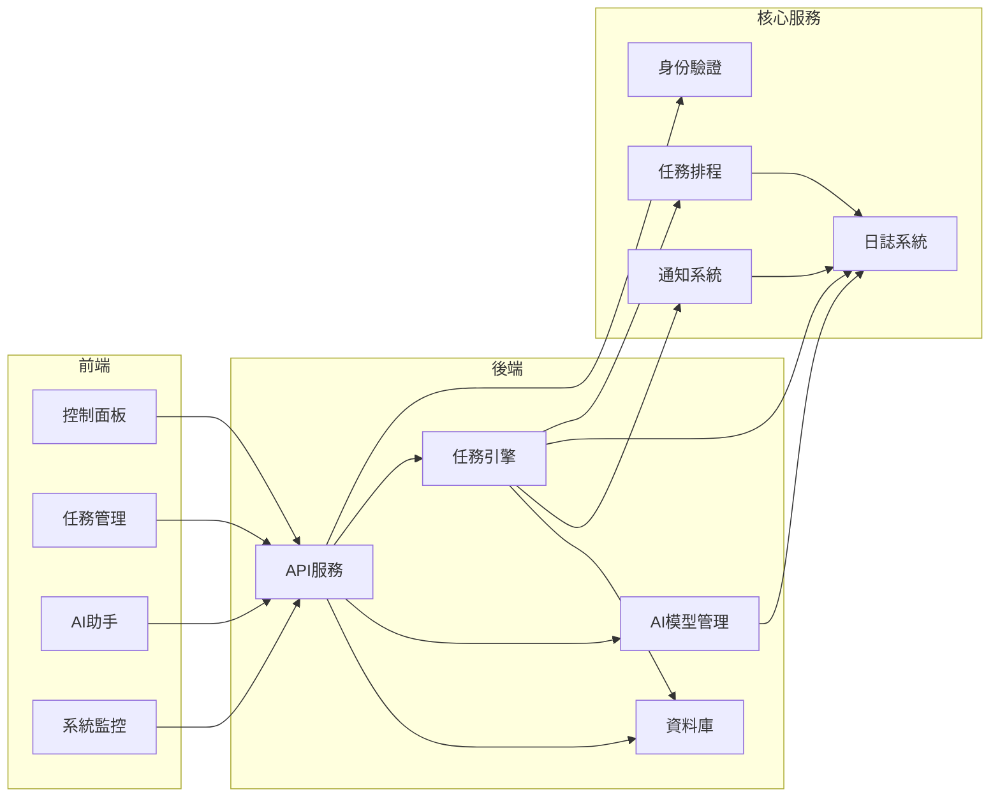

# 影月系統整體架構

## 目標

影月系統分成三層：前端、後端、核心服務。現有 MVP 保留原本的 `services/`、`pipelines/`、`scripts/` 執行路徑，新的模組骨架則往更清楚的產品架構靠攏，方便後續擴充控制面板、任務管理、AI 助手與系統監控。

## 分層設計

### 前端
- 控制面板：聚合 KPI、今日報表、任務摘要、系統健康狀態。
- 任務管理：建立、停用、重試、查詢任務與排程。
- AI 助手：用自然語言觸發查詢、整理報表、協助排錯。
- 系統監控：展示 API 健康、排程狀態、資源使用量與告警。

### 後端
- API 服務：提供前端與外部整合使用的 HTTP 介面。
- 任務引擎：負責工作流、重試、排程觸發、執行紀錄。
- AI 模型管理：管理模型設定、推理入口、供應商切換與版本控制。
- 資料庫：保存新聞、報表、任務狀態、監控資料與系統設定。

### 核心服務
- 身份驗證：登入、權限、角色與 API 金鑰驗證。
- 日誌系統：操作日誌、錯誤追蹤、審計紀錄。
- 任務排程：每日作業、週期作業、手動補跑、排程狀態查詢。
- 通知系統：任務完成、失敗、告警與系統事件推播。

## 目前程式碼對應

- `services/api/main.py`：目前主要 API 服務入口。
- `apps/api/routes.py`：API 對外匯出層。
- `apps/worker/main.py`：任務執行入口，可演進為任務引擎進程。
- `services/core/storage.py`：資料庫與儲存存取。
- `pipelines/scheduling/`：目前排程與每日作業入口。
- `scripts/health_check.py`、`scripts/status_report.py`：系統監控與狀態輸出。

## 建議目錄骨架

```text
yingyue-system/
  apps/
    frontend/
      dashboard/
      task_management/
      ai_assistant/
      system_monitoring/
    api/
    worker/

  services/
    api/
    core/
      auth/
      logging_system/
      task_scheduler/
      notifications/
      model_management/
      storage.py

  pipelines/
    scheduling/

  docs/
    system_architecture.md
```

## 模組互動

1. 前端頁面透過 API 服務讀取任務、報表、健康狀態。
2. API 服務呼叫任務引擎與核心服務。
3. 任務引擎執行管線、健康檢查、報表產生與補跑流程。
4. AI 模型管理為 AI 助手與分析流程提供一致的模型呼叫入口。
5. 資料庫保存執行結果，日誌系統記錄事件，通知系統在關鍵節點發送訊息。

## Mermaid 圖



## 落地順序

1. 先完成前端四個頁面的 API 契約。
2. 把 `apps/worker` 擴成可追蹤狀態的任務引擎。
3. 把模型設定集中到 `services/core/model_management/`。
4. 補上身份驗證、通知與系統監控頁面。
5. 最後再做前端框架選型與 UI 實作。
